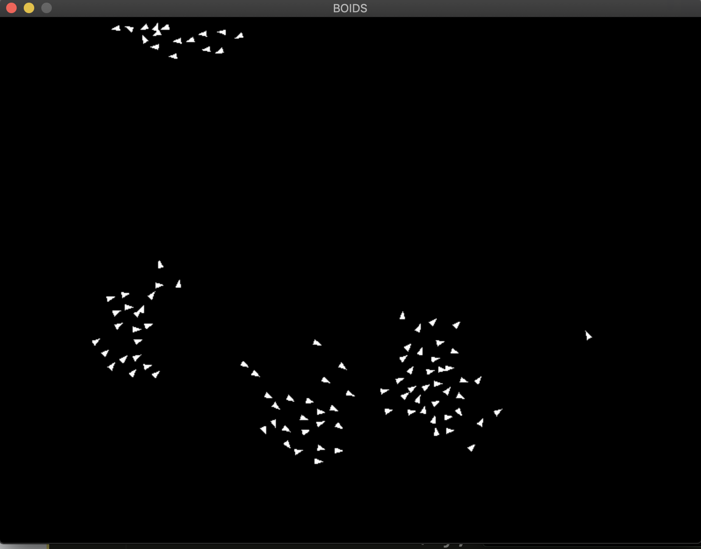

Love2D Project

All boids move with the following logic:
1. Align: Move toward the same direction as nearby alias
2. Separate: Prevent bumping into one another
3. Center: Move toward the center of nearby alias
4. Wall: Prevent bumping into walls
